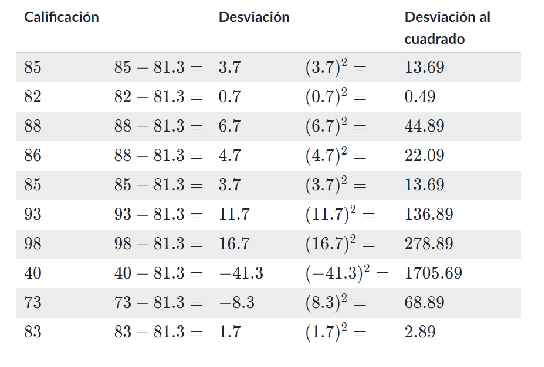

# Aprendizaje Programando en la naturaleza

## El comienzo:

En primera instacia, preparamos nuestro setup con las tecnoligías que vamos a trabajar, en este caso usaremos **Processing.js** un render basado en canvas como entorno de desarrollo, **p5.js** es la librería que trabajaremos que se desprende de processing, usando su **CDN**, también se puede instalar usando **NPM**.

## Adam el Walker:

Usando las funciones de render de **p5.js** definimos el canvas y lo que processing iba a dibujar:

    function setup() {
        createCanvas(600, 600);
    } /*siendo esta quien define el tamaño del canvas

    function draw() {
    }/*Y esta el render que se ejecua infinitamente*/

## Las probabilidades:

Usando un generador "random" pudimos establecer probabilidades para la generación, en este caso, de un "ciclo de lluvia" dónde según la estación llovería con mayot o menor frecuencia.

- Cada estación cuenta con una probabilidad distita de lluvia:

        primavera: 0.3,
        verano: 0.1,
        otoño: 0.5,  /* 0.5 = 50% de probabilidad*/
        invierno: 0.85,

## Distribución normal de números aleatorios

Generamos una distribución random uniforme tal cual como encontramos en la naturaleza, usando una **La Media ó Promedio** una medida de tendencia central, también llamamos a la **distribución Gaussiana** O si eres frances **Distribución Laplaciana**/  
  

- El promedio es la suma de todos los datos dividido en el número de datos

            1,5,6,6,8,12 /*tenemos seis niños y estas son sus edades
            La media es igual a:*/
                (1+5+6+6+8+12) / 6
                Resultado: 6,33
-Para calcular la varianza:

        Después calculamos el promedio de las desviaciones al cuadrado, que se conoce como la varianza. Esa es la suma de la última columna dividida entre el número de renglones:
        Varianza = 2288.1/102288.1/102288, point, 1, slash, 10 = 228.81228.81

# Distribución personalizada de números aleatorios

#### Un vuelo de Lévy

Es un patrón de conducta encontrado en la naturaleza, especificamente en los animales, diversos estudios se han hecho a distintas especies de animales sean bien cazadores, presas u otros organismos.

